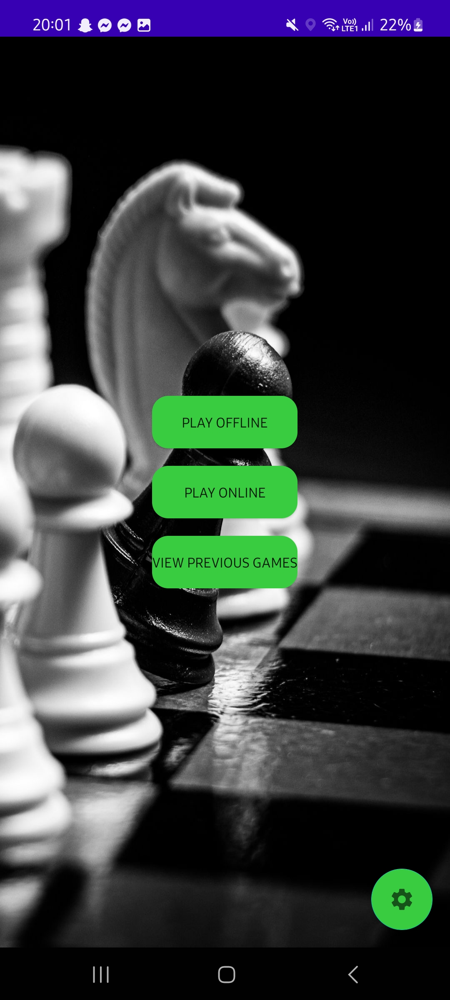
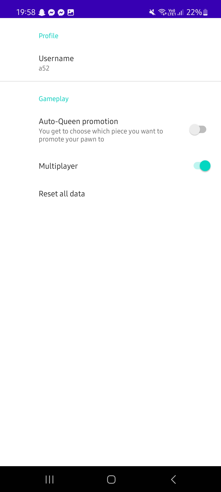
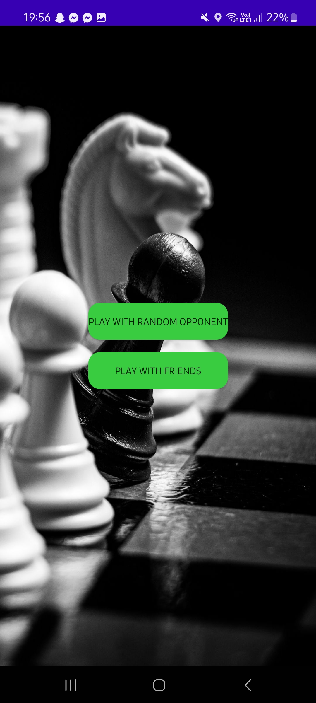
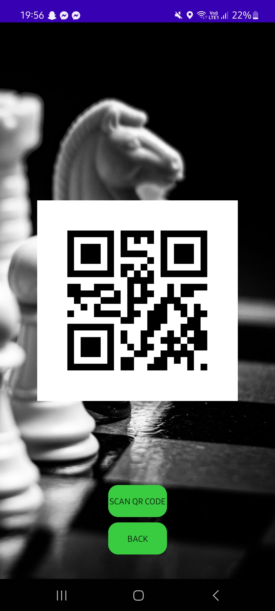
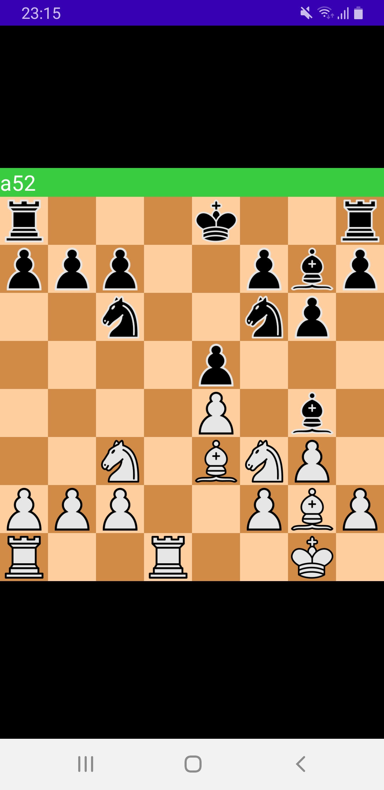
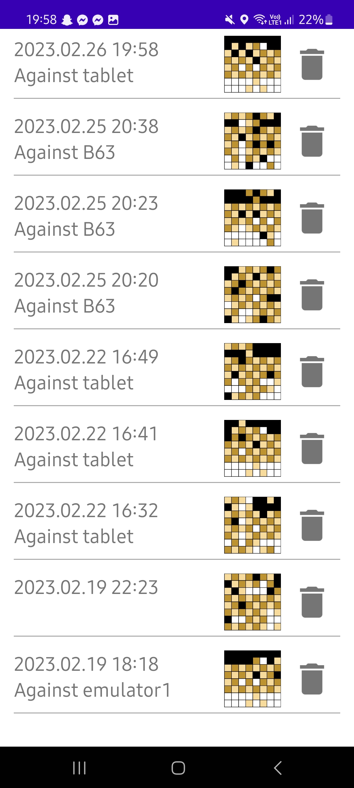

# Chess for Android mobile devices

## Main Menu
You can start an offline game, enter settings and enter the multiplayer menu (Still work in progress) 

## Settings menu
You can edit basic settings for the game, such as timer, auto-queen promotion and username for multiplayer games.

## Game view
As you can see, it's a basic chess board. 

### When you select a piece, the fields are highlighted on which you can step. 

### When in check, the field of your King in check is highlighted.

### Even if it's highlighted, when in check, you can't step on a field which does not prevent check.

## Multiplayer
### You can join with random selection, or via scanning a QR code.

### The same board from both sides

## Previous games list
